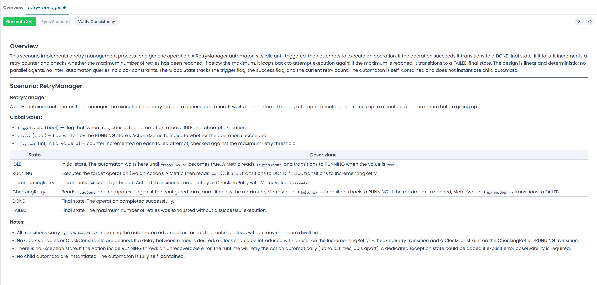

# Generating a Scenario

The scenario is the structured natural-language description of an automaton — the bridge between your intent and the XAL file. Arianna helps you build it through a conversational flow.

---

## Starting a chat session

You can start a scenario generation from two entry points:

**From a free session** — open the sessions panel in the chat header and create a new session. This session starts with no linked file. Describe the process, generate the scenario, and Arianna will assign a suggested filename when it delivers the result. The `.xal` file is created later, when you click **Generate XAL**.

**From an existing file** — right-click a `.xal` file in the **Repository Explorer** and select **New chat** (or **Open with chat** if a session already exists). The session is pre-linked to that file and pre-titled with the file name. The file does not need to have content.

---

## Describing the process

Type a description of the automaton's behaviour in the chat input. There are no strict format requirements — plain language works well. Include:

- what condition or event the automaton monitors
- what states it can be in
- what actions or notifications it triggers
- any timing or threshold constraints

You can describe everything at once or build up the scenario through several exchanges. Arianna asks follow-up questions when the description is ambiguous or incomplete.

---

## Generating the scenario

When Arianna considers the description sufficient to produce a minimal scenario, the **Generate Scenario** button becomes active in the chat toolbar.

Click **Generate Scenario**. Arianna produces a structured scenario in Markdown format and delivers it as a collapsible card in the chat. At the same time:

- the `.scenario.md` satellite file is created in the repository explorer alongside the `.xal` file
- the **scenario tab** opens in the editor, showing the rendered scenario

/// caption
Fig.1 - The scenario card (left) and the open scenario tab (right) after generation (screenshot pending)
///

---

## Refining the scenario

Read the scenario in the tab. If something is incorrect or missing, describe the change in the chat and ask Arianna to update it. Each regeneration replaces the `.scenario.md` file and refreshes the tab.

!!! info "The scenario is the source of truth"
    During the generation phase, the scenario is what Arianna works from. The XAL has not been generated yet — refine the scenario until it accurately describes the intended behaviour before proceeding.

When the scenario is ready, proceed to [Generating XAL](generating_xal.md).
