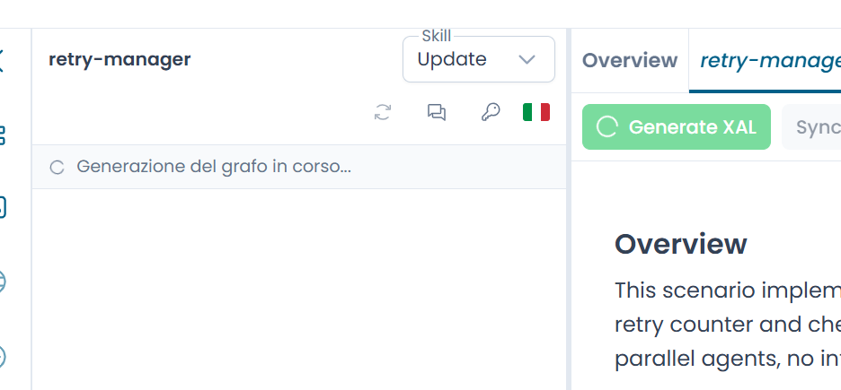

# Generare l'XAL

Una volta che lo scenario è pronto nel tab scenario, puoi generare il file XAL con un solo click.

---

## Avviare la generazione

Apri il tab scenario e clicca **Generate XAL** nella barra delle azioni sotto il contenuto dello scenario.

Il pulsante è attivo solo quando è presente uno scenario e nessuna generazione è già in corso.

La pipeline si svolge in due passi, indicati nell'area di stato del pannello chat:

1. **Generating the graph…** — Arianna produce una rappresentazione intermedia in formato GraphViz `.dot` dell'automa, basata sullo scenario.
2. **Converting to XAL…** — il file `.dot` viene passato al converter di Xautomata, che produce l'XAL finale.

Quando entrambi i passi si completano con successo, il file XAL viene creato (o sovrascritto) nel repository explorer, caricato nel grafo del Designer e collegato alla sessione corrente.

/// caption
Fig.1 - I messaggi di stato durante la generazione XAL ///

---

## Retry automatico in caso di errori di validazione

Se l'XAL generato non supera la validazione, Arianna riprova automaticamente fino a due volte (tre tentativi totali). Ad ogni retry passa l'intera storia degli errori di validazione a Claude, così lo stesso errore non viene ripetuto. L'area di stato mostra il numero del tentativo corrente.

La maggior parte degli errori di validazione viene risolta al primo retry.

---

## Se tutti i tentativi falliscono

Se tutti e tre i tentativi producono un XAL non valido, il pannello chat mostra:

- gli errori di validazione in chiaro, per capire cosa è andato storto
- un pulsante **Download XAL** per l'ultimo file generato — spesso è quasi corretto e una piccola modifica manuale è sufficiente
- un pulsante **Download .dot** (nella sezione *Advanced*) per chi vuole correggere il sorgente GraphViz manualmente e ripassarlo al converter

!!! note
    Una generazione fallita non sovrascrive nessun file `.xal` già presente nel repository. La versione precedente viene preservata.

---

## Variabili Global State

Dopo una conversione riuscita, Arianna popola automaticamente le variabili `GlobalState` di ogni automa in base alle variabili elencate nello scenario. Questo passo avviene in silenzio — non devi avviarlo manualmente. Le variabili popolate sono subito visibili nel pannello **Global State Variables**.

Se lo scenario non elenca nessuna variabile, viene usato un placeholder predefinito che può essere modificato manualmente nel Designer.
