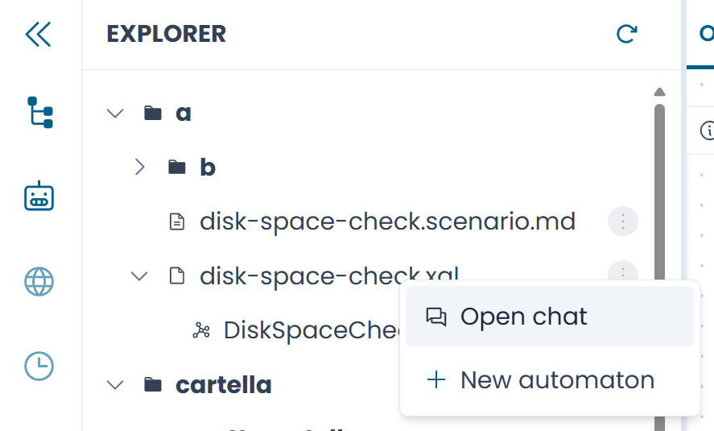
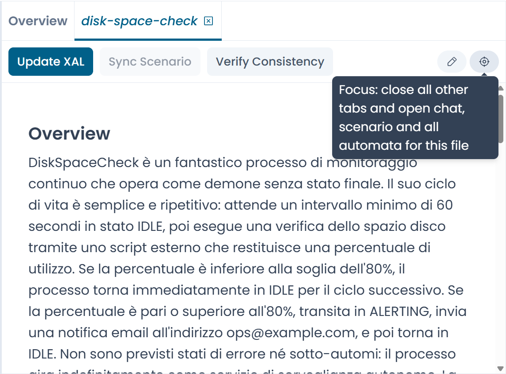

# AI Assistant — Panoramica

Arianna è l'assistente AI integrato nel XAL Designer. Ti aiuta a partire da una descrizione in linguaggio naturale di un processo e arrivare a un file XAL valido e strutturato — mantenendo i due artefatti sincronizzati man mano che uno o l'altro evolve.

---

## Il modello dei file

Capire come Arianna organizza il proprio lavoro è fondamentale prima di usarla. Sono sempre coinvolti tre artefatti, collegati per struttura.

### Sessione chat, scenario e file XAL

Ogni sessione chat è legata esattamente a un file XAL. La sessione ricorda la cronologia della conversazione, lo scenario generato e l'ultimo XAL prodotto. Questo collegamento è permanente per tutta la vita della sessione: la chat lavora *su quel file*, indipendentemente da quale tab è attiva nell'editor.

Lo **scenario** è la descrizione strutturata in linguaggio naturale dell'automa — l'artefatto intermedio tra la tua intenzione e l'XAL. Vive in un file `.scenario.md` dedicato, che Arianna crea automaticamente.

I tre artefatti formano una triade:

```
patch_oracle.xal            ← il file dell'automa
patch_oracle.scenario.md    ← lo scenario (satellite, stesso base name)
                            ← la sessione chat (collegata a patch_oracle.xal)
```

!!! info "Una sessione per file"
    Non possono coesistere due sessioni chat collegate allo stesso file XAL. Se apri una chat per un file che ha già una sessione, quella esistente viene riattivata.

### Il file satellite

Il file scenario è un **satellite** del file XAL: vive sempre nella stessa directory e condivide lo stesso base name, con estensione `.scenario.md` al posto di `.xal`. Questa co-location è strutturale — il collegamento tra i due non viene mai memorizzato esplicitamente; è derivato dal path.

Il file scenario può esistere prima del file XAL (Arianna lo crea non appena lo scenario è pronto), ma non può mai trovarsi in una directory diversa. Spostare o rinominare il file XAL richiede di aggiornare di conseguenza il path del file scenario.

### Un solo tab scenario alla volta

L'editor consente di avere aperto un solo tab scenario alla volta. È una scelta intenzionale: il tab scenario e la sessione chat attiva sono sempre sincronizzati, e avere più tab scenario aperti simultaneamente violerebbe questo contratto. Se passi a una sessione chat diversa, il tab scenario corrente viene chiuso e lo scenario della nuova sessione (se presente) viene aperto al suo posto.

---

## Aprire una sessione chat

Per collegare una sessione chat a un file XAL, clicca con il tasto destro sul file nel **Repository Explorer**.

La voce del menu contestuale cambia a seconda che esista già una sessione per quel file:

| Voce | Condizione | Effetto |
|---|---|---|
| **Open with chat** | Esiste già una sessione per questo file | Passa alla sessione attiva per questo file; apre il tab scenario se lo scenario è presente |
| **New chat** | Non esiste nessuna sessione per questo file | Crea una nuova sessione collegata al file; il titolo viene pre-compilato con il nome del file |

Le stesse voci sono disponibili sui file `.scenario.md` — sia lo scenario che l'XAL condividono la stessa sessione.


/// caption
Fig.1 - La voce "Open with chat" nel menu contestuale del Repository Explorer (screenshot in attesa)
///

---

## Il tab scenario

Quando Arianna genera uno scenario, il Designer apre un **tab scenario** nell'editor. Mostra lo scenario strutturato in Markdown renderizzato ed espone i pulsanti per le azioni one-shot — **Generate XAL**, **Verify Consistency** e **Sync Scenario** — direttamente sotto il contenuto.

### Il pulsante Focus

L'intestazione del tab scenario include un pulsante **Focus**. Cliccarlo:

1. Chiude tutti i tab appartenenti ad altri file XAL
2. Apre tutti gli automi definiti nel file XAL collegato

Usa Focus quando vuoi concentrare il workspace su un unico file — per esempio, dopo aver navigato tra più automi e voler avere una vista pulita di quello su cui stai lavorando.

!!! note
    Focus è disponibile solo nell'intestazione del tab scenario, non nel menu contestuale. Se lo scenario è in modalità modifica con modifiche non salvate, Focus è bloccato finché le modifiche non vengono salvate o scartate.


/// caption
Fig.2 - Il tab scenario. Il pulsante Focus si trova nell'angolo in alto a destra dell'intestazione del tab (screenshot in attesa)
///

---

## Cosa può fare Arianna

Una volta aperta una sessione chat, Arianna può aiutarti con le seguenti attività. Ognuna è descritta in una pagina dedicata.

| Attività | Quando usarla |
|---|---|
| [Generare uno scenario](generating_scenario.md) | Hai una descrizione in linguaggio naturale e vuoi produrre uno scenario strutturato |
| [Generare l'XAL](generating_xal.md) | Lo scenario è pronto e vuoi generare il file XAL |
| [Aggiornare l'XAL](updating_xal.md) | Lo scenario è cambiato e vuoi propagare le modifiche all'XAL esistente |
| [Sincronizzare lo scenario](syncing_scenario.md) | Hai modificato l'XAL manualmente e vuoi aggiornare lo scenario di conseguenza |
| [Verificare la consistenza](verify_consistency.md) | Vuoi controllare che scenario e XAL siano semanticamente allineati |
| [Generare uno scenario dall'XAL](scenario_from_xal.md) | Hai un file XAL esistente senza scenario e vuoi ricostruirne uno |
| [Sessioni chat](sessions.md) | Gestire più sessioni, modalità chat e flussi guidati |
