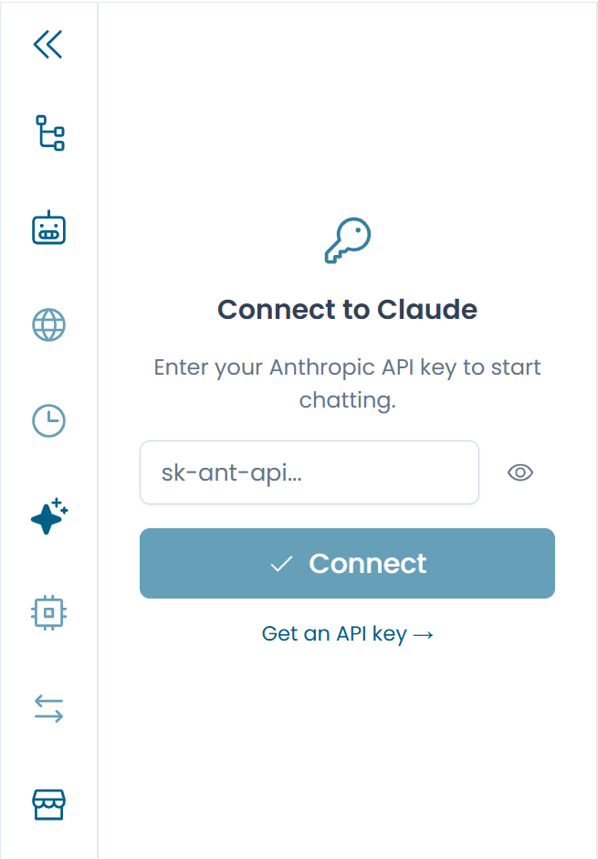

# Configurazione — API Key

Arianna richiede una API key di Anthropic per funzionare. La chiave viene salvata localmente nel tuo browser e non viene mai inviata ai server di Xautomata — viene usata esclusivamente per le chiamate dirette all'API di Claude.

---

## Inserire la chiave

Clicca sull'icona **Wand** nella barra laterale sinistra per aprire il pannello AI Assistant. Se non è configurata nessuna chiave, compare un prompt che ti chiede di inserirla.

Incolla la tua API key di Anthropic e clicca **Confirm**. La chiave viene validata immediatamente; se non è valida o non ha i permessi necessari, viene mostrato un messaggio di errore.

/// caption
Fig.1 - Il prompt di inserimento della API key
///

---

## Rimuovere la chiave

Per cancellare la chiave salvata — ad esempio prima di lasciare un computer condiviso — apri il pannello AI Assistant e clicca sull'**icona a forma di chiave** (Change API key). Questa operazione disconnette Arianna e rimuove tutte le sessioni chat collegate a file del repository. Le sessioni collegate a file caricati localmente vengono conservate.

---

!!! warning "Sicurezza della chiave"
    La tua API key è salvata nel local storage del browser. Non usare Arianna su un computer condiviso o pubblico senza rimuovere la chiave al termine della sessione.

---

## Lingua

La lingua di risposta di Arianna è una preferenza globale che si applica a tutte le sessioni chat. Controlla sia la lingua con cui Claude risponde, sia i testi dell'interfaccia all'interno del pannello chat (placeholder, messaggi di stato vuoto e call-to-action).

Per cambiare la lingua, clicca sull'**icona della bandiera** nell'intestazione della chat. Si apre un piccolo popover con le opzioni disponibili — attualmente **Inglese** (predefinito) e **Italiano**. Seleziona quella desiderata per applicarla immediatamente; la preferenza viene salvata in un cookie del browser e persiste tra le sessioni.

!!! note
    L'impostazione della lingua è indipendente dalla lingua in cui scrivi. Anche se scrivi in inglese, Claude risponderà nella lingua impostata qui — e viceversa.
