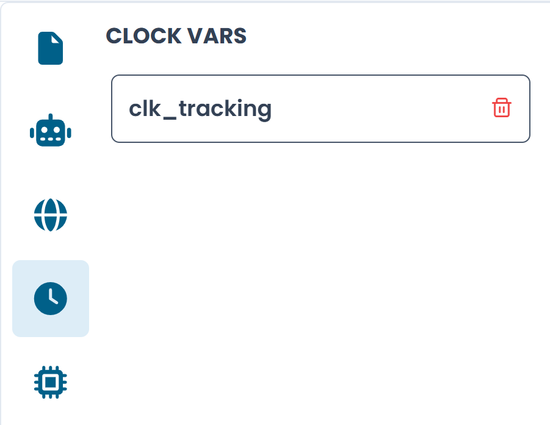

# Clock Variables

Clock variables are timer identifiers used in transitions to measure elapsed time and enforce time-based conditions.

To view and manage clock variables, click the **clock icon** in the left sidebar. The panel shows all clocks defined for the currently active automaton.

/// caption
Fig.1 - The Clock Variables panel
///

---

## Adding a clock

Click **+** or the add button to create a new clock. A clock has a single required field: its **name**. This name is used in clock constraints and clock resets on transitions.

Unlike global state variables, clocks have no type or default value — they are purely time counters.

---

## Deleting a clock

Click the **trash icon** on a clock card to remove it. Before deleting a clock, make sure no transitions in the automaton reference it in a clock constraint or clock reset.

---

## Using clocks in transitions

Once a clock is defined, it becomes available in the **Clocks** section of the transition configuration panel:

- **Clock Constraint** — add a condition such as `clk_retry >= 5 min` that must be satisfied for the transition to fire
- **Clock Reset Variables** — select clocks to reset when the transition fires

For a full explanation of how clocks drive time-based logic, see [Clocks and Time](../../concepts/clocks.md).
