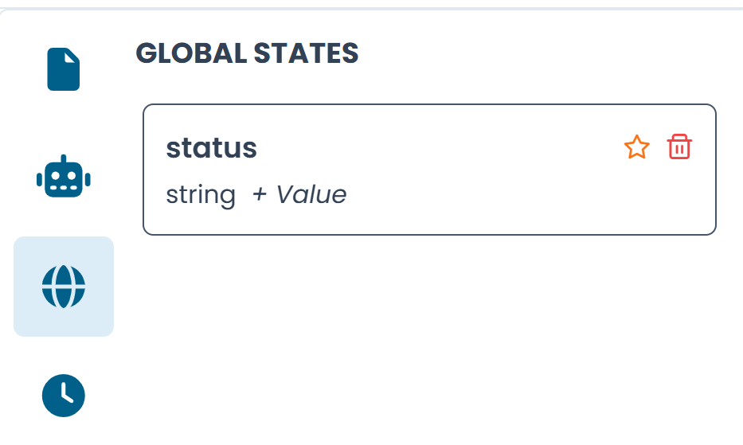

# Global State Variables

Global state variables store data that persists across the entire lifecycle of an automaton instance. They act as the automaton's memory — holding values that states and transitions can read and write.

To view and manage global state variables, click the **globe icon** in the left sidebar. The panel shows all variables defined for the currently active automaton.

/// caption
Fig.1 - The Global State Variables panel
///

---

## Adding a variable

Click **+** or the add button to create a new variable. Each variable has:

| Field | Description |
|---|---|
| **Name** | The identifier used to reference the variable throughout the automaton |
| **Type** | The data type (e.g. `string`, `int`, `boolean`, `list`) |
| **Value** | An optional default value assigned when the automaton is first instantiated |

---

## Editing a variable

Click on a variable card to edit it inline. Changes are applied immediately to the automaton.

To delete a variable, click the **trash icon** on the variable card.

---

## How variables are used

Global state variables are referenced in:

- **Metric input and output parameters** — passing values to a metric function or capturing its results
- **Action input and output parameters** — providing context to an action or storing its output
- **TransitionNew input parameters** — passing data to a child automaton at the moment it is spawned
- **Clock constraints** — when a variable stores a threshold value used in a time condition

!!! info
    Variables whose names match a global state option in the automaton are automatically prefixed with `this.GLOBALSTATE_` in the XAL output. This prefix is handled transparently by the designer — you never need to type it manually.
