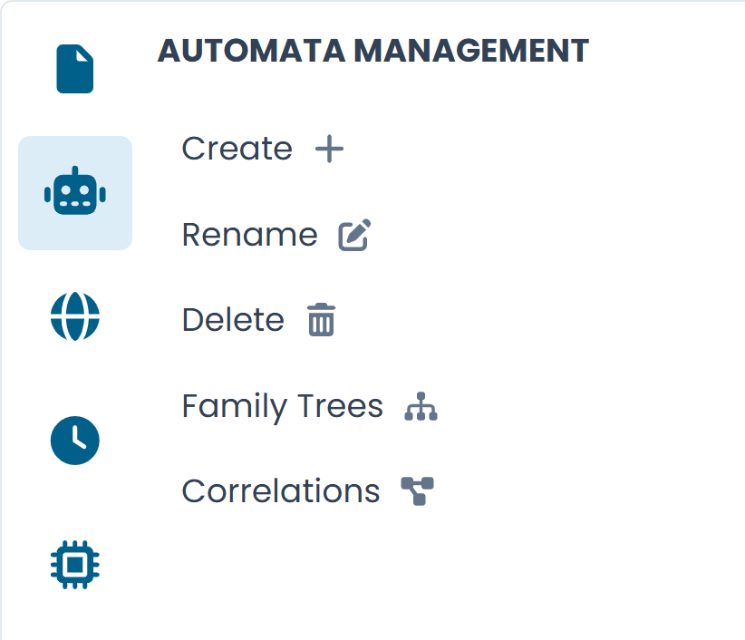
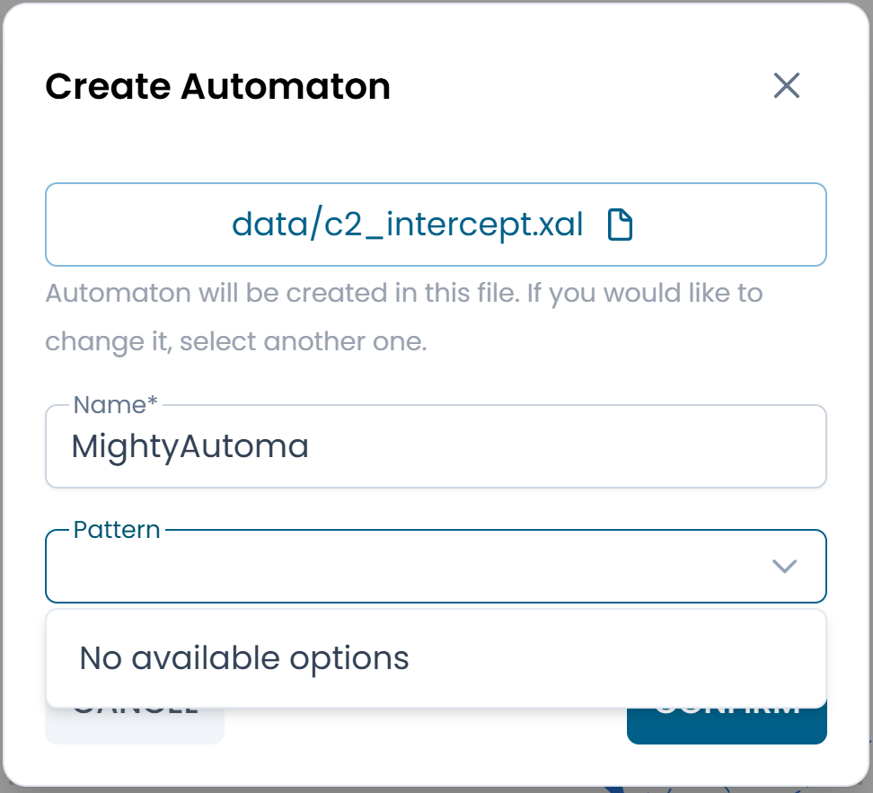

# Gestione degli Automi

Il pannello **Automata Management** fornisce strumenti per creare e organizzare gli automi all'interno del file attualmente caricato.

Per aprirlo, fai clic sull'**icona robot** nella barra laterale sinistra.

/// caption
Fig.1 - Il pannello Automata Management
///

---

## Creare un automa

Fai clic su **Create** per aprire la finestra di dialogo di creazione.

/// caption
Fig.2 - La finestra di dialogo Create Automaton
///

Compila i seguenti campi:

| Campo | Descrizione |
|---|---|
| **File** | Il file XAL in cui verrà creato l'automa. Pre-compilato con il file attualmente aperto. Fai clic sull'icona file per selezionarne uno diverso. |
| **Name** | L'identificatore univoco dell'automa all'interno del file. Obbligatorio. |
| **Pattern** | Un template opzionale da usare come punto di partenza. *(Coming soon)* |

Fai clic su **Confirm** per creare l'automa. Si apre immediatamente come nuovo tab nel canvas con un diagramma vuoto.

---

## Rinominare un automa

Fai clic su **Rename** per cambiare il nome dell'automa attualmente attivo.

!!! warning
    Rinominare un automa aggiorna il suo identificatore nel file. Qualsiasi altro automa che vi fa riferimento per nome — tramite una `TransitionNew` o una query Metric — dovrà essere aggiornato manualmente.

---

## Eliminare un automa

Fai clic su **Delete** per rimuovere l'automa attualmente attivo dal file.

!!! warning
    L'eliminazione è immediata e non può essere annullata all'interno del designer. Esegui il Commit delle modifiche prima di eliminare se vuoi preservare la possibilità di ripristinare l'automa dal controllo versione.

---

## Family Trees e Correlations

Le opzioni **Family Trees** e **Correlations** nel pannello non sono ancora attive.

Quando disponibili, forniranno viste filtrate del Process Overview focalizzate rispettivamente sulle relazioni genitore-figlio e sull'intero grafico delle correlazioni dell'automa selezionato.
