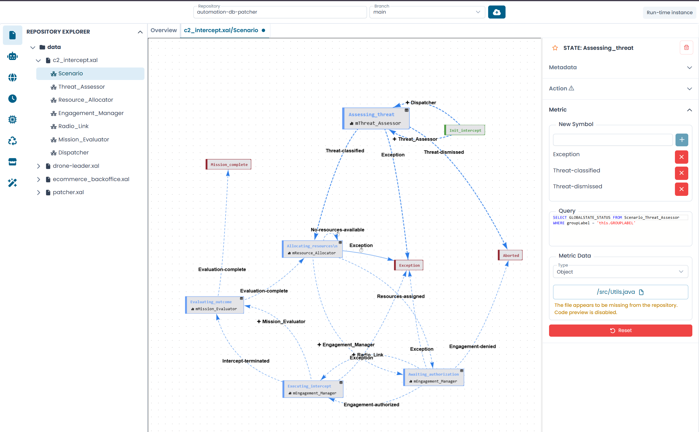

# The Interface

The XAL Designer interface is organized into four main areas that work together during an editing session.

/// caption
Fig.1 - The XAL Designer interface with an automaton open (screenshot pending)
///

---

## Top bar

The top bar is always visible and provides access to global controls.

| Element | Description |
|---|---|
| **Repository** | Shows the currently connected repository. Click to change it. |
| **Branch** | Selects the branch to work on. |
| **Upload / Commit button** | When connected to a VCS: opens the Commit & Push dialog. When working in browser mode: opens the file upload dialog. |
| **Run-time Instance** | Reserved for future use — will allow connecting to a live platform instance. |

---

## Left sidebar

The sidebar provides access to all editing panels and tools. Click an icon to open the corresponding panel.

| Icon | Panel | Description |
|---|---|---|
| File | Repository Explorer | Browse the file and automaton tree of the connected repository |
| Robot | Automata Management | Create, rename, and delete automata |
| Globe | Global State Variables | Manage the global state variables of the active automaton |
| Clock | Clock Variables | Manage the clock variables of the active automaton |
| Microchip | New State | Add a new state to the active automaton |
| Recycle | New Transition | Add a new transition to the active automaton |
| Store | Marketplace | *(Coming soon)* |
| Wand | AI Assistant | Opens the Arianna chat panel |

---

## Canvas

The canvas occupies the central area of the interface.

It displays one of two views depending on the active tab:

- **Overview** — the correlation graph showing all automata in the repository and their relationships
- **Automaton diagram** — the interactive graph of a specific automaton, with states as nodes and transitions as edges

You can pan the canvas by clicking and dragging on an empty area, and zoom with the scroll wheel. Individual nodes can be dragged to reposition them.

At the bottom of the canvas, two buttons provide **undo** and **redo** for layout changes.

---

## Right panel

The right panel shows the configuration form for the currently selected element on the canvas.

It opens automatically when you click on a state node or a transition edge. It closes when you click on an empty area of the canvas or press the **×** button in the panel header.

The panel content changes depending on what is selected:

- **State selected** — shows the state Metadata, Action, and Metric sections
- **Transition selected** — shows the transition Metadata, Clocks, and Parameters sections

Changes made in the panel are applied immediately to the automaton, with a short debounce delay.

---

## Tabs

Each open automaton appears as a tab in the tab bar, next to the persistent **Overview** tab.

A **dot indicator** on a tab signals that the automaton has uncommitted changes. Clicking a tab switches the canvas to that automaton. Clicking the **×** on a tab closes it — if there are uncommitted changes, a confirmation dialog appears first.
