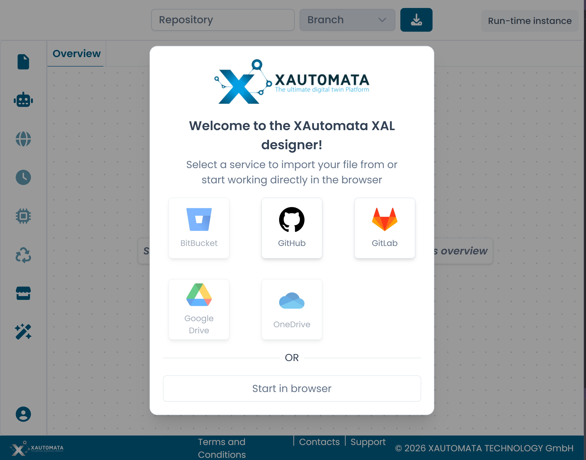
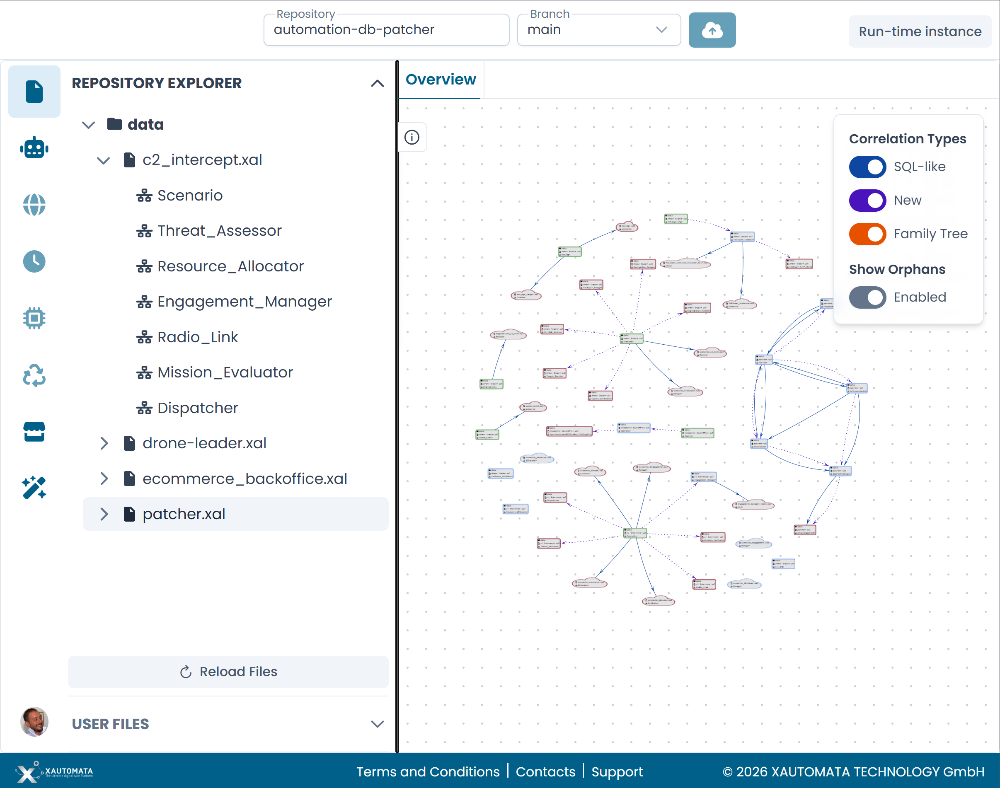

# Opening a File

When you open the XAL Designer, a welcome dialog lets you choose how to load your XAL files.

/// caption
Fig.1 - The welcome dialog
///

---

## Connecting to a repository

Select one of the available version control providers: **GitHub**, **GitLab**, or **Bitbucket**.

After authenticating, use the **Repository** and **Branch** fields in the top bar to select the repository and branch you want to work with. The designer loads the file tree automatically.

Once connected, the **Repository Explorer** in the left sidebar shows the folder and file structure of the selected branch. XAL files are listed under their respective directories and can be expanded to show the automata they contain.

To open an automaton, click its name in the repository explorer. It opens as a new tab on the canvas.

/// caption
Fig.2 - The Repository Explorer with a loaded repository
///

---

## Working in the browser

Select **Start in browser** to work without connecting to a version control system. Use the upload button in the top bar to load a local `.xal` file from your computer.

!!! warning
    Changes made in browser mode cannot be committed to a repository. Make sure to export or save your work manually before closing the session.

!!! note
    A known issue affects the upload button in browser mode. See `qa.md` — Q7 for details.

---

## Switching repositories

To switch to a different repository or branch, update the **Repository** and **Branch** fields in the top bar at any time. The designer reloads the file tree accordingly.
