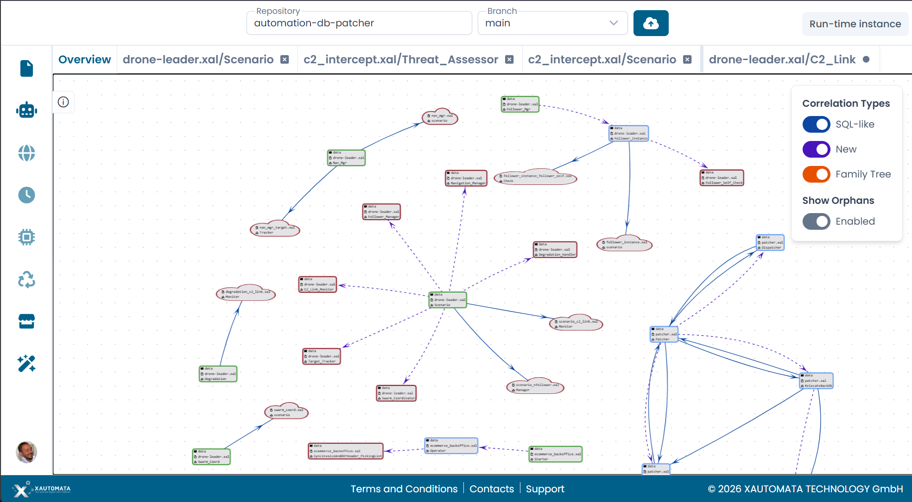

# XAL Designer — Panoramica

Il XAL Designer è un editor visuale basato sul web per creare e modificare automi definiti in file XAL.

---

## Cosa puoi fare

Con il XAL Designer puoi:

- connetterti a un repository Git (GitHub, GitLab, Bitbucket) o lavorare direttamente nel browser
- sfogliare e aprire file XAL dall'explorer del repository
- visualizzare le relazioni tra tutti gli automi in un repository tramite il Process Overview
- aprire singoli automi e modificarne stati, transizioni e variabili su un canvas interattivo
- configurare metadati degli stati, Action, Metric, vincoli Clock e passaggio di parametri
- fare Commit e Push delle modifiche direttamente al repository collegato

---

## L'interfaccia in sintesi

Il designer è organizzato in tre aree principali.

La **barra laterale sinistra** fornisce navigazione e strumenti di modifica. Le sue icone danno accesso a:

| Icona | Pannello |
|---|---|
| File | Repository Explorer |
| Robot | Automata Management |
| Globo | Global State Variables |
| Orologio | Clock Variables |
| Microchip | Add new state |
| Riciclo | Add new transition |
| Store | Marketplace *(coming soon)* |
| Bacchetta | AI Assistant (Arianna) |

Il **canvas** occupa l'area centrale. Mostra il grafico del Process Overview oppure il diagramma interattivo dell'automa attualmente aperto.

Il **pannello destro** mostra il modulo di configurazione per lo stato o la transizione attualmente selezionati. Si apre automaticamente quando si fa clic su un nodo o un arco nel canvas.

---

## Tab

Ogni automa aperto appare come tab nella barra superiore, accanto al tab **Overview**. È possibile avere più automi aperti contemporaneamente e passare liberamente dall'uno all'altro.

Un indicatore a punto su un tab segnala che l'automa ha modifiche non ancora committate.

/// caption
Fig.1 - L'interfaccia del XAL Designer
///
