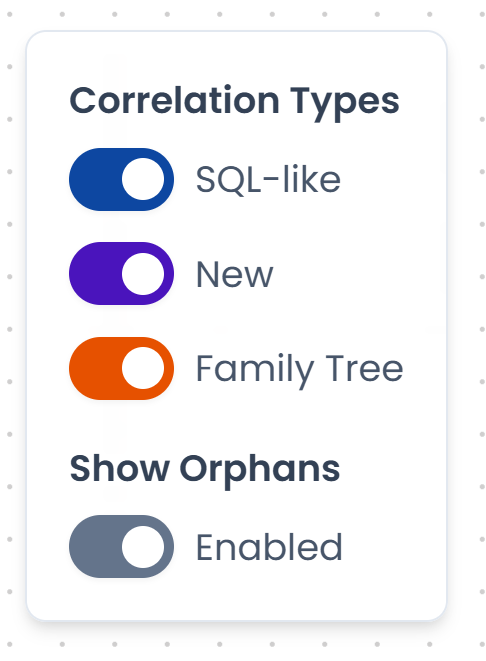

# Correlation Types

The Process Overview shows three types of relationships between automata. Each type is represented by a distinct line style and can be toggled on or off independently.

---

## SQL-like

A **SQL-like** correlation (solid blue line) connects an automaton to another whose state it reads through a metric query.

When a metric in automaton A contains a query that reads the global state of automaton B, the designer draws an SQL-like edge from A to B. This represents a data dependency: A observes B's state to drive its own transitions.

This is the most common type of correlation in monitoring scenarios.

---

## New

A **New** correlation (dashed purple line) connects a parent automaton to a child automaton that it spawns.

When an automaton uses a `TransitionNew` or `TransitionNewMulti` to instantiate another automaton, the designer draws a New edge from the parent to the child. This represents a lifecycle dependency: the parent creates and monitors the child as part of its process flow.

---

## Family Tree

A **Family Tree** correlation (dotted orange line) connects an automaton to an external system or function it calls directly through its `System` configuration, using the `automaton` function type.

This type of correlation is less common and represents a lower-level integration dependency.

---

## Orphan nodes

An **orphan** is an automaton that has no connections to other automata in the current view. Orphans may be standalone automata, automata whose connections are filtered out, or automata that only connect to external repositories.

Use the **Show Orphans** toggle in the top-right filter panel to include or exclude orphan nodes from the graph.

/// caption
Fig.1 - The correlation type filter panel
///
