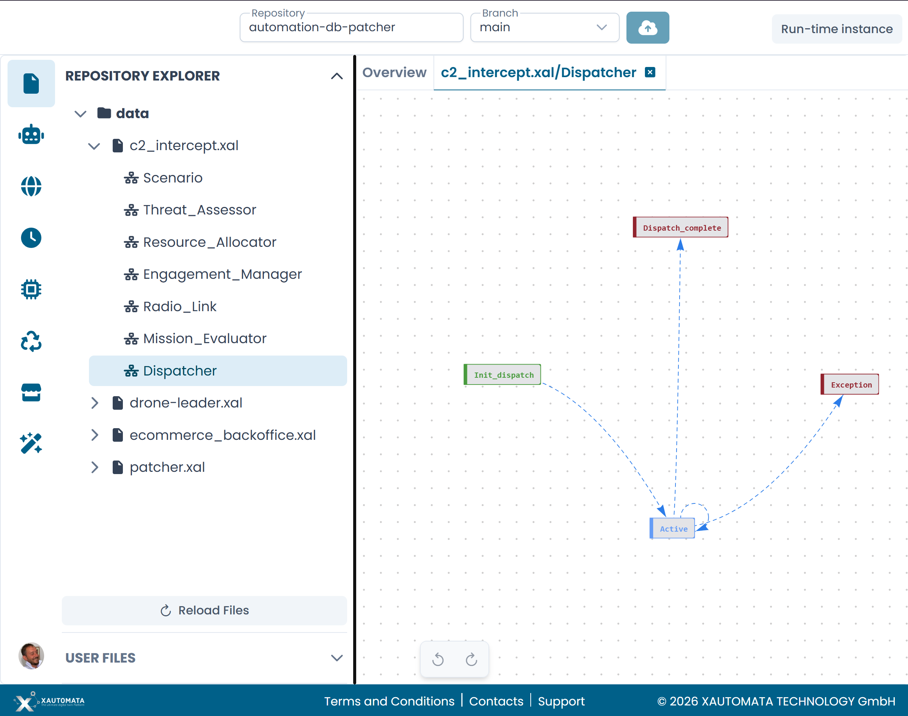

# Aprire un Automa

È possibile aprire un automa per la modifica da due punti: il grafico del Process Overview e il Repository Explorer.

---

## Dal Process Overview

Il tab Overview mostra il grafico delle correlazioni di tutti gli automi nel repository.

**Doppio clic** su qualsiasi nodo del grafico per aprire l'automa corrispondente nel canvas. Appare come nuovo tab nella barra dei tab.

Un singolo clic su un nodo evidenzia solo le sue connessioni — non apre l'automa. Assicurati di fare doppio clic.

!!! note
    I nodi che rappresentano automi in repository esterni (mostrati con un bordo rosso) non possono essere aperti direttamente dall'Overview, poiché i loro file sorgente non fanno parte del repository corrente.

---

## Dal Repository Explorer

Fai clic sull'**icona file** nella barra laterale sinistra per aprire il Repository Explorer.

L'explorer mostra la struttura delle cartelle del repository collegato. I file XAL possono essere espansi per mostrare gli automi che contengono. Ogni automa è elencato sotto il suo file con un'icona robot.

Fai clic sul nome di un automa per aprirlo nel canvas.

/// caption
Fig.1 - Un file XAL espanso nel Repository Explorer che mostra i suoi automi
///

---

## Lavorare con più automi

Ogni automa aperto appare come tab separato. È possibile avere più automi aperti contemporaneamente e passare liberamente dall'uno all'altro facendo clic sui rispettivi tab.

Aprire lo stesso automa una seconda volta sposta il focus sul tab esistente anziché aprire un duplicato.

---

## Tornare all'Overview

Fai clic sul tab **Overview** in qualsiasi momento per tornare al grafico delle correlazioni. I tab degli automi rimangono aperti in background — il lavoro non viene perso.
