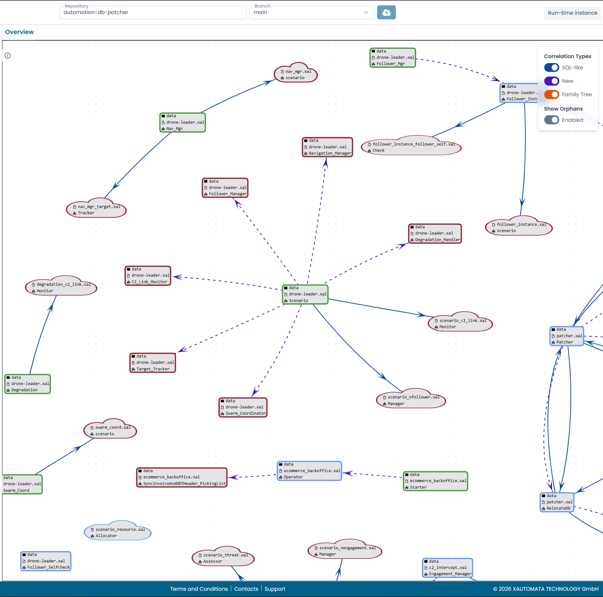

# Reading the Process Overview

The **Overview** tab displays a graph of all the automata in the loaded repository and the relationships between them.

This view gives you a bird's-eye picture of the entire automation system — which automata exist, how they are connected, and which ones reference automata in other repositories.

/// caption
Fig.1 - The Process Overview graph
///

---

## Node shapes

Each node in the graph represents an automaton. The shape of the node indicates where the automaton is defined.

| Shape | Meaning |
|---|---|
| Rounded rectangle (card) | Automaton defined in the current repository |
| Cloud | Automaton referenced by file name, path not resolved |
| Ellipse | Automaton referenced by name only (Global State variable) |

Nodes that reference automata in external repositories are displayed with a red border. These automata exist and run at platform level, but their source files are not part of the current repository.

---

## Node border colors

The border color of a card node reflects its role in the correlation graph.

| Border color | Meaning |
|---|---|
| Green | Only outgoing connections — a source automaton |
| Red | Only incoming connections — a leaf automaton, or an external reference |
| Blue | Both incoming and outgoing connections — an intermediate automaton |

---

## Interacting with the graph

**Single-click** on a node to highlight all its connections. The edges connected to that node become thicker and show their labels.

**Double-click** on a node to open the corresponding automaton on the canvas as a new tab.

The graph supports panning and zooming. Nodes can be dragged to rearrange the layout — their positions are preserved during the session but reset on page reload.

---

## Filtering

Use the controls in the top-right corner to show or hide specific correlation types, and to toggle the visibility of orphan nodes — automata that have no connections to other automata in the current view.

!!! info
    For a description of the three correlation types and what they represent, see [Correlation Types](correlation_types.md).
