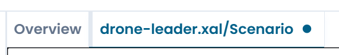
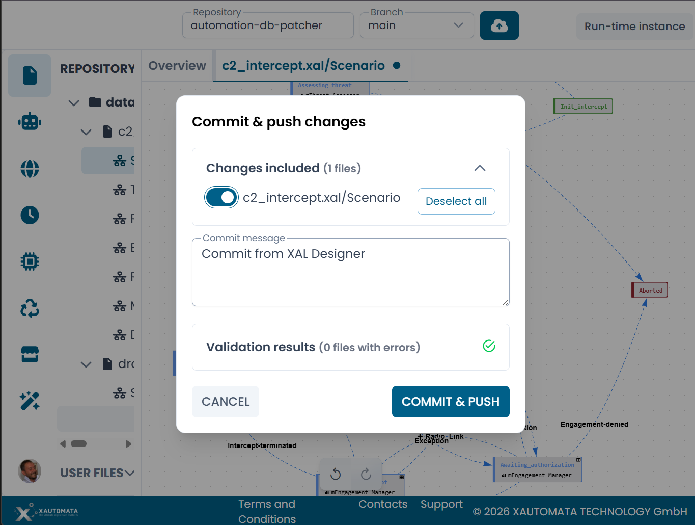

# Commit and Push

When you have finished editing an automaton, you can publish your changes back to the connected repository using the **Commit & Push** function.

---

## The unsaved changes indicator

While you are editing, a **dot indicator** appears on the tab of any automaton that has uncommitted changes. This includes structural edits (adding or removing states and transitions), configuration changes, and layout changes such as moving nodes on the canvas.

/// caption
Fig.1 - The dot indicator signals uncommitted changes on a tab
///

---

## Opening the commit dialog

Click the **upload/commit button** in the top bar to open the **Commit & Push** dialog.

/// caption
Fig.2 - The Commit & Push dialog
///

The dialog shows:

| Section | Description |
|---|---|
| **Changes included** | A list of all modified files. Each file has a toggle to include or exclude it from the commit. Use **Deselect all** to uncheck all files at once. |
| **Commit message** | A text field for the commit message, pre-filled with `Commit from XAL Designer`. Edit it to describe your changes. |
| **Validation results** | The result of the backend validation run on all included files. A green checkmark and **0 files with errors** means all files are valid and ready to commit. |

---

## Validation before commit

Before the commit is sent, the platform validates all included XAL files against the schema and runtime rules. This is the authoritative validation — it is the same check that runs when the platform loads an automaton.

If any file contains errors, the validation results section shows the number of files with errors. Resolve the issues before committing.

!!! note
    The designer may show form validation warnings (such as field format messages) that are independent of the backend validation. A file that passes backend validation is considered correct, even if the designer shows minor warnings.

---

## Completing the commit

Once the validation passes, click **Commit & Push** to publish your changes. The changes are pushed to the selected branch of the connected repository.

The dot indicator disappears from the affected tabs after a successful commit.

---

## Closing with unsaved changes

If you attempt to close a tab that has uncommitted changes, the designer displays a confirmation dialog:

> **Uncommitted changes — Are you sure you want to close?**

Click **Confirm** to discard the changes and close the tab. Click **Cancel** to return to the editor.

!!! warning
    Closing a tab with uncommitted changes permanently discards those changes. They cannot be recovered from within the designer.
