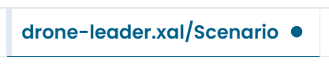

# Uncommitted Changes

Every edit you make in the XAL Designer is applied immediately to the automaton in memory. Changes are not automatically saved to the repository — you must commit them explicitly when you are ready.

---

## What counts as a change

The designer tracks any modification to the automaton as an uncommitted change. This includes:

- adding, renaming, or deleting states
- adding, modifying, or deleting transitions
- changing state or transition configuration in the right panel
- updating global state variables or clock variables
- moving a state node on the canvas

Even repositioning a node on the canvas — without changing any configuration — is recorded as a change, because the node position is stored in the XAL file.

---

## The dot indicator

When an automaton has uncommitted changes, a **dot** appears on its tab in the tab bar.

/// caption
Fig.1 - The dot indicator on a tab with uncommitted changes
///

The dot disappears after a successful commit.

---

## Closing a tab with uncommitted changes

If you try to close a tab that has uncommitted changes, the designer shows a confirmation dialog:

> **Uncommitted changes — Are you sure you want to close?**

| Button | Effect |
|---|---|
| **Cancel** | Returns to the editor. Your changes are preserved. |
| **Confirm** | Closes the tab and discards all uncommitted changes permanently. |

!!! warning
    Discarded changes cannot be recovered from within the designer. If you need to keep your work, commit before closing.

---

## Undoing changes

The canvas provides **undo** and **redo** buttons at the bottom of the canvas area (↺ ↻) for reverting layout changes such as node repositioning.

For configuration changes made in the right panel — such as renaming a state or modifying a transition condition — use the **Reset** button available in each configuration section to revert that section to its last saved state.

There is no global undo for all changes at once. If you want to discard all uncommitted changes to an automaton, close its tab and confirm when prompted — then reopen the automaton from the repository.

---

## When you are ready to publish

Once you have reviewed your changes and are satisfied, use the **Commit & Push** function to publish them to the repository.

See [Commit and Push](commit.md) for the full commit workflow.
