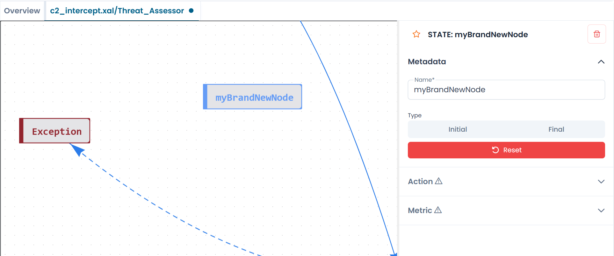

# Creating a State

States are the nodes of the automaton diagram. You can create a new state at any time while an automaton is open on the canvas.

---

## Adding a state

Click the **microchip icon** in the left sidebar. A new state node named `NewNode` appears immediately on the canvas, and the configuration panel opens on the right.

/// caption
Fig.1 - A newly created state on the canvas
///

The state is created immediately — there is no separate confirmation step. As soon as you type a name, the node updates on the canvas in real time.

---

## Naming a state

In the **Name** field of the Metadata section, replace `NewNode` with your chosen identifier. State names must be unique within the automaton.

If you enter a name that is already in use, the panel displays a validation message asking you to choose a different name.

---

## Setting the state type

Use the **Type** selector to mark the state as **Initial** or **Final**.

- Select **Initial** to make this the starting state of the automaton. An automaton can have only one initial state.
- Select **Final** to mark this as a terminal state. An automaton can have multiple final states. When the automaton reaches a final state, it stops processing.

Leave both options unselected for intermediate states.

---

## Moving states on the canvas

Drag a state node to reposition it on the canvas. The layout is not constrained — place nodes wherever makes the diagram easiest to read.

!!! note
    Moving a node counts as a change. The tab indicator will show a dot, signaling uncommitted modifications.

---

## Deleting a state

To delete a state, select it on the canvas and click the **trash icon** in the top-right corner of the configuration panel.

!!! warning
    Deleting a state also removes all transitions connected to it. This action cannot be undone within the designer session.
