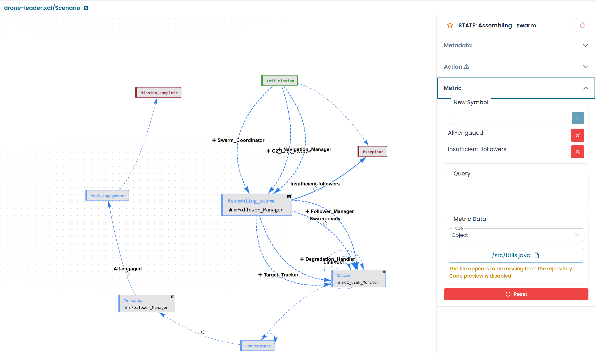

# Configuring State Metrics

A metric associated with a state defines what the automaton observes while it is in that state. The values returned by the metric determine which outgoing transition fires next.

To configure a metric, select a state on the canvas and expand the **Metric** section in the right panel.


/// caption
Fig.1 - The Metric section of a state configuration panel
///

---

## Enumeration values

The enumeration defines the set of values the metric can return. Each value corresponds to a possible outcome that an outgoing transition can match against.

To add a value, type it in the **New Symbol** field and click **+**. To remove a value, click the **×** button next to it.

!!! info
    Enumeration values are used as **Metric Value** conditions on outgoing transitions. If a transition's metric value does not match any value in the enumeration, it will never fire.

---

## Query

The **Query** field contains the SQL-like statement used to read the metric's value at runtime. It typically reads the global state of another automaton or a monitored object.

A query follows this pattern:

```sql
SELECT GLOBALSTATE_STATUS FROM <File>_<Automaton> WHERE groupLabel = 'this.GROUPLABEL'
```

The `this.GROUPLABEL` binding ensures the query targets the correct instance of the automaton — the one running on the same monitored object.

When a query is configured, the state node on the canvas displays a **grid icon** in its top-right corner.

---

## Metric Data configuration

The **Metric Data** section specifies how the metric is executed.

| Field | Description |
|---|---|
| **Type** | The execution context: `Object` for metrics tied to monitored infrastructure objects, `Automaton` for metrics that reference other automaton instances directly |
| **System file** | The path to the implementation file (e.g. `/src/Utils.java`) used by the platform to resolve the metric at runtime |

If the system file is not found in the current repository, the designer displays a warning. This does not prevent the automaton from functioning — the file may exist in the platform's runtime environment.

---

## Resetting the metric

Click **Reset** to clear the entire metric configuration from the state.

!!! warning
    Resetting a metric removes the query, all enumeration values, and the system file reference. Any transitions that rely on metric values from this state will no longer have matching conditions.
