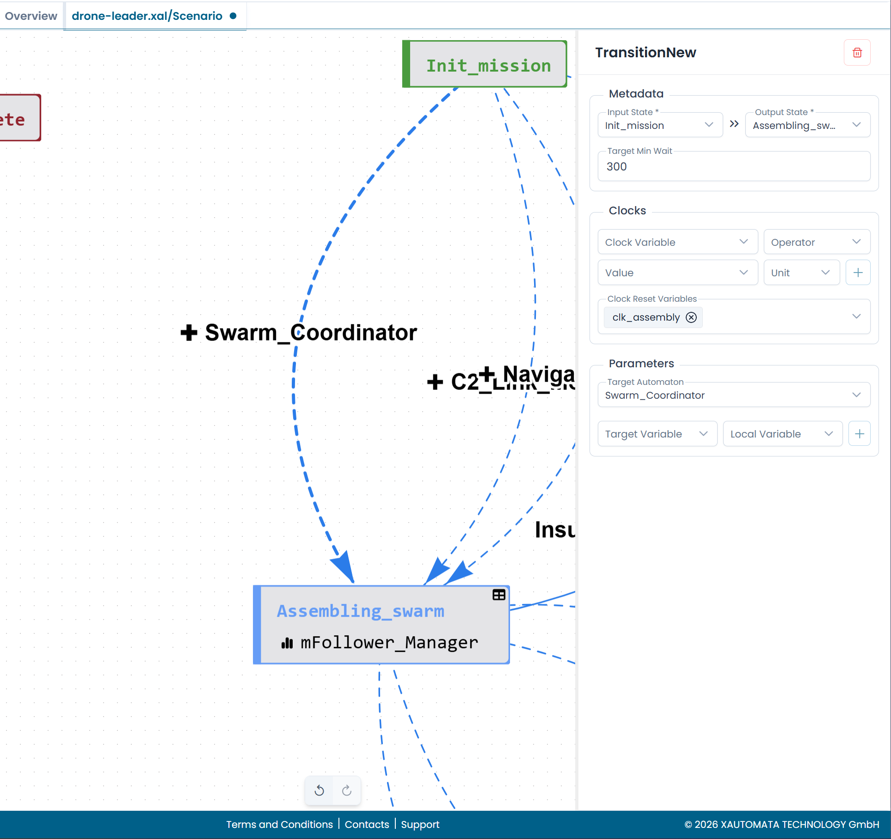

# Spawning Child Automata (TransitionNew)

A **TransitionNew** does two things when it fires: it moves the automaton to the output state, and it instantiates a new child automaton. This is the mechanism used to build automaton families.

---

## Configuring a TransitionNew

When you set a **Target Automaton** in the Parameters section of a transition, the transition automatically becomes a TransitionNew.

/// caption
Fig.1 - The TransitionNew configuration panel
///

---

## Target Automaton

Select the automaton to spawn from the **Target Automaton** dropdown. The available options include:

- All automata defined in the current XAL file
- Global state variables, if the target automaton is determined dynamically at runtime

The selected automaton is instantiated as a new independent instance when the transition fires.

---

## Target Min Wait

The **Target Min Wait** field sets a minimum delay (in seconds) before the child automaton begins processing after being spawned. This is useful when the child needs to wait for the parent to stabilize before it starts reading the parent's state.

---

## Input Parameters

The **Parameters** section lets you pass values from the parent automaton's global state to the child at the moment it is created.

Each parameter mapping consists of:

| Field | Description |
|---|---|
| **Target Variable** | The name of the variable in the child automaton's global state |
| **Local Variable** | The name of the variable in the parent automaton's global state to read from |

Click **+** to add a parameter mapping. Click **×** to remove one.

!!! info
    The child automaton must have the corresponding variables defined in its own global state for the values to be received correctly.

---

## Monitoring the child

Once the child is running, the parent monitors its progress through a metric. The metric reads the child's global state using a SQL-like query that targets the child automaton by name and group label.

As the child transitions through its states and eventually reaches a final state, the parent's metric returns the corresponding value and the appropriate transition fires.

For a conceptual overview of this pattern, see [Automaton Families](../../concepts/families.md).

---

## Canvas representation

TransitionNew edges appear as **dashed arrows** on the canvas. The label shows the name of the spawned automaton prefixed with a **+** symbol.

When multiple TransitionNew edges leave the same state, each spawns a different child automaton — all of them are created when the parent enters that state.
